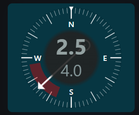
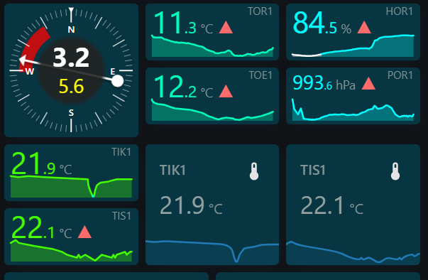
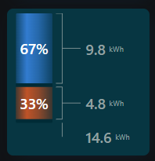

# SVG Cards

[](https://github.com/vitska/ha-wind-dir-card/releases)
[](https://github.com/hacs/integration)

A collection of Home Assistant Lovelace cards drawn entirely in SVG, so they
scale cleanly to whatever tile they're given and expose a large set of styling
options.

| Card | Type | What it does |
| ---- | ---- | ------------ |
| [Wind Direction Card](#wind-direction-card) | `custom:wind-dir-card` | Compass dial with wind direction, average-direction sector, speed and gusts |
| [Sensor Ex Card](#sensor-ex-card) | `custom:sensor-ex-card` | Sensor readout with label, value, unit and a history graph |
| [Distribution Ex Card](#distribution-ex-card) | `custom:distribution-ex-card` | Compare numeric entities as a segmented bar with a toggleable legend |

Registering the single `ha-cards.js` resource makes every card in the
collection available.

## Install

### Via HACS (custom repository)

1. HACS → Frontend → menu (⋮) → **Custom repositories**.
2. Add this repository's URL, category **Lovelace**.
3. Install "SVG Cards", then reload your browser.

### HACS update

1. HACS → Frontend → **SVG Cards** → menu (⋮) → **Redownload**
   (or use the update notification/badge HACS shows when a new release is
   available).
2. Reload the dashboard with a hard refresh (Ctrl+Shift+R / Cmd+Shift+R) so
   the browser picks up the new resource instead of a cached copy.
3. If it still looks unchanged, restart Home Assistant or use Settings →
   General → hamburger menu → **Clear cache and reload**.

### Manual

1. Copy `ha-cards.js` from the repo root into `<config>/www/ha-cards.js`.
   That one file contains every card — it has no other dependencies.
2. In Settings → Dashboards → Resources, add:
   - URL: `/local/ha-cards.js`
   - Type: JavaScript Module
3. Reload the dashboard.

If you only want a single card, `wind-dir-card.js`, `sensor-ex-card.js` and
`distribution-ex-card.js` are also self-contained and can be used instead.

Open the browser console after loading — the collection logs an `SVG CARDS`
banner with its version, which is the quickest way to confirm which build is
actually running.

### Manual update

If you installed manually (not via HACS), pull in new versions like this:

1. Download the latest `ha-cards.js` from this repo (or `git pull` if you
   cloned it) and overwrite the copy in `<config>/www/`.
2. Bump the cache-busting version so browsers/HA actually fetch the new files
   instead of cached copies: in Settings → Dashboards → Resources, edit the
   `/local/ha-cards.js` resource and add/update a `?v=` query string,
   e.g. `/local/ha-cards.js?v=2` (increment it on every update).
3. Reload the dashboard with a hard refresh (Ctrl+Shift+R / Cmd+Shift+R) so
   the browser doesn't serve the old cached module.
4. If the card still shows old behavior, restart Home Assistant or clear the
   frontend cache (Settings → General → hamburger menu → **Clear cache and
   reload**) to force a full reload of custom card resources.

## Wind Direction Card

`custom:wind-dir-card` — an SVG compass showing:

- momentary wind direction (arrow)
- average wind direction sector (translucent arc overlay)
- cardinal directions (N/E/S/W) with a tick ring
- momentary wind speed (center readout)
- wind gusts (secondary readout)

The card resizes to fill whatever tile it's given (e.g. one column of a
`horizontal-stack`) while staying square.



Shown here in a dashboard beside several Sensor Ex Cards:



### Configuration

The card has a visual editor: add it via the dashboard's "Add Card" picker
(search for "Wind Direction Card") or edit an existing card and switch to the
"UI" tab — no YAML required, though YAML editing is still fully supported.

| Option                      | Required | Description                                                              |
| ---------------------------- | -------- | ------------------------------------------------------------------------- |
| `type`                        | yes      | `custom:wind-dir-card`                                                    |
| `wind_direction_entity`       | yes      | Entity with momentary wind direction in degrees (0–360)                   |
| `wind_speed_entity`           | yes      | Entity with momentary wind speed                                          |
| `wind_gust_entity`            | no       | Entity with wind gust speed, shown as a secondary readout                 |
| `wind_direction_avg_entity`   | no       | Entity with average wind direction in degrees, drives the sector overlay  |
| `sector_width`                | no       | Width in degrees of the average-direction sector arc (default `60`)       |
| `sector_color`                | no       | CSS color for the sector overlay (default `red`)                          |
| `sector_opacity`              | no       | Opacity (0–1) of the average-direction sector overlay (default `0.35`)    |
| `scale_color`                 | no       | CSS color for the tick ring, cardinal labels and north marker (default `white`) |
| `arrow_color`                 | no       | CSS color for the direction arrow (default `white`)                       |
| `speed_unit`                  | no       | Overrides the unit shown for speed/gust (default: entity's own unit)      |
| `show_speed_unit`             | no       | Show/hide the unit text under the speed value (default `false`)           |
| `show_gust_unit`              | no       | Show/hide the unit text next to the gust value (default `false`)          |
| `speed_precision`             | no       | Decimal places shown for the speed readout (default `1`)                  |
| `gust_precision`              | no       | Decimal places shown for the gust readout (default `1`)                   |
| `speed_font_size`             | no       | Font size in px for the center speed value (default `40`)                 |
| `gust_font_size`              | no       | Font size in px for the gust label (default `30`)                         |
| `arrow_size`                  | no       | Scale factor for the direction arrow's length/thickness (default `1.25`)  |
| `arrow_type`                  | no       | Arrow shape: `arrow` (shaft + head + tail circle, default), `needle` (diamond), or `line` (shaft + small head) |
| `arrow_shadow`                | no       | Add a drop shadow under the direction arrow/needle for depth (default `true`) |
| `arrow_shadow_color`          | no       | CSS color for the arrow shadow (default `black`)                          |
| `arrow_shadow_offset`         | no       | Vertical offset in px for the arrow shadow (default `2`)                  |
| `color_normal`                | no       | CSS color for speed/gust values below any warning threshold (default `white`) |
| `color_warning`               | no       | CSS color for speed/gust values at/above their warning threshold (default `yellow`) |
| `color_danger`                | no       | CSS color for speed/gust values at/above their danger threshold (default `red`) |
| `speed_warning_threshold`     | no       | Speed value at/above which the speed readout switches to `color_warning` (default `3`) |
| `speed_danger_threshold`      | no       | Speed value at/above which the speed readout switches to `color_danger` (default `4`) |
| `gust_warning_threshold`      | no       | Gust value at/above which the gust readout switches to `color_warning` (default `3`) |
| `gust_danger_threshold`       | no       | Gust value at/above which the gust readout switches to `color_danger` (default `4`) |
| `center_bg_color`             | no       | CSS color for the round gradient background behind the speed value, rendered above the arrow (default `#222222`) |
| `center_bg_opacity`           | no       | Opacity (0–1) at the center of that gradient, fading to transparent at its edge (default `0.9`) |
| `padding`                     | no       | Padding in px around the dial inside the tile (default `0`, fills the tile edge-to-edge) |
| `name`                        | no       | Optional card header/title                                                |

### Example

Just the entities are required — every styling option above already has a
sensible default (red sector, white scale/arrow, black arrow shadow, dial
filling the tile edge-to-edge, warning/danger thresholds at 3/4, etc.):

```yaml
type: horizontal-stack
cards:
  - type: custom:wind-dir-card
    wind_direction_entity: sensor.roof_wt32_s1_wind_station_wind_direction
    wind_direction_avg_entity: sensor.roof_wt32_s1_wind_station_wind_direction_avg_60s
    wind_speed_entity: sensor.roof_wt32_s1_wind_station_wind_speed
    wind_gust_entity: sensor.roof_wt32_s1_wind_station_wind_gust_30s
```

Override any option to taste, e.g. back to a plain white-on-dark look with
larger padding and no arrow shadow:

```yaml
type: horizontal-stack
cards:
  - type: custom:wind-dir-card
    name: Wind
    wind_direction_entity: sensor.wind_direction
    wind_direction_avg_entity: sensor.wind_direction_avg
    wind_speed_entity: sensor.wind_speed
    wind_gust_entity: sensor.wind_gust
    sector_color: "#58a6ff"
    padding: 8
    arrow_shadow: false
    show_speed_unit: true
    show_gust_unit: true
```

### Notes

- If an entity is `unavailable`/`unknown`, the affected part of the dial is
  hidden and the card dims slightly instead of erroring.
- The needle always turns the short way round, including across north — a swing
  from 350° to 10° moves 20° forwards rather than 340° backwards.
- Colors are pulled from your active HA theme (`--primary-text-color`,
  `--card-background-color`, etc.) with sensible dark-theme fallbacks, so the
  card looks reasonable in both light and dark themes without configuration.

## Sensor Ex Card

`custom:sensor-ex-card` — the equivalent of Home Assistant's built-in sensor
card, drawn in SVG so every part is styleable:

- label (entity name, or your own)
- entity icon
- large value with its unit
- filled area or line graph of the entity's recorder history

Text and graph are drawn at the card's real pixel size, so nothing is stretched
or distorted whatever tile shape it lands in. With `padding: 0` (the default)
the graph runs edge to edge.


The sensor cards above show most of what the card can do. The compact ones use
smaller decimals, trend arrows, labels pinned to the top right, and
`value_format` rules colouring the value, the label and the graph together per
range. The two at the bottom right keep the plainer look: a left label with an
icon and an unbanded graph.

### Configuration

Only `entity` is required. The card has a visual editor, same as the compass.

| Option              | Required | Description                                                                 |
| ------------------- | -------- | --------------------------------------------------------------------------- |
| `type`               | yes      | `custom:sensor-ex-card`                                                      |
| `entity`             | yes      | The sensor entity to display                                                 |
| `name`               | no       | Label text (default: the entity's friendly name)                             |
| `icon`               | no       | Icon override (default: the entity's own icon)                               |
| `unit`               | no       | Unit override (default: the entity's `unit_of_measurement`)                  |
| `value_precision`    | no       | Decimal places for the value (default `1`)                                   |
| `show_label`         | no       | Show the label (default `true`). Hiding it does not move the value |
| `label_position`     | no       | `top` (default, above the value) or `bottom` (below it)                      |
| `label_align`        | no       | `left`, `center` or `right` (default `right`)                                        |
| `value_align`        | no       | `left` (default), `center` or `right`                                        |
| `show_value`         | no       | Show the value (default `true`)                                              |
| `show_unit`          | no       | Show the unit next to the value (default `true`)                             |
| `show_icon`          | no       | Show the icon (default `false`)                                               |
| `show_graph`         | no       | Show the history graph (default `true`)                                      |
| `show_trend`         | no       | Show the trend arrow next to the value (default `true`)                      |
| `trend_hours`        | no       | Window of history the trend is measured over, in hours (default `1`)         |
| `trend_threshold`    | no       | Deadband — a change smaller than this counts as flat (default `0`)           |
| `trend_color_up`     | no       | Color of the rising arrow (default `#ff6b6b`)                                |
| `trend_color_down`   | no       | Color of the falling arrow (default `#58a6ff`)                               |
| `trend_color_flat`   | no       | Color of the flat marker (default: theme secondary text color)               |
| `trend_font_size`    | no       | Trend arrow size in px (default `20`)                   |
| `trend_up_symbol`    | no       | Symbol for a rising trend (default `▲`)                                      |
| `trend_down_symbol`  | no       | Symbol for a falling trend (default `▼`)                                     |
| `trend_flat_symbol`  | no       | Symbol for no significant change (default `–`)                               |
| `label_color`        | no       | CSS color for the label (default: theme secondary text color)                |
| `value_color`        | no       | CSS color for the value (default: theme primary text color)                  |
| `unit_color`         | no       | CSS color for the unit (default: theme secondary text color)                 |
| `icon_color`         | no       | CSS color for the icon (default: theme icon color)                           |
| `label_font_size`    | no       | Label font size in px (default `12`)                                         |
| `value_font_size`    | no       | Value font size in px (default `34`)                                         |
| `value_font_weight`  | no       | Value font weight (default `normal`, matching the built-in sensor card)      |
| `value_margin`       | no       | Offset of the value from the top in px (default `5`; negatives pull it up)   |
| `label_margin`       | no       | Offset of the label from its own edge in px (default `0`)                    |
| `blink_interval`     | no       | How long the readout spends visible, then hidden, in ms (default `250`, floor `200`) |
| `value_format`       | no       | List of value-range formatting rules (see below)                             |
| `unit_font_size`     | no       | Unit font size in px (default `14`)                                          |
| `decimal_font_size_percent` | no | Size of the decimal fraction as a % of `value_font_size` (default `55`) |
| `icon_size`          | no       | Icon size in px (default `24`)                                               |
| `color_normal`       | no       | Value color below any threshold (default: falls back to `value_color`)       |
| `color_warning`      | no       | Value color at/above `warning_threshold` (default `#ffa600`)                 |
| `color_danger`       | no       | Value color at/above `danger_threshold` (default `#ff4136`)                  |
| `warning_threshold`  | no       | Value at/above which the readout turns `color_warning`                       |
| `danger_threshold`   | no       | Value at/above which the readout turns `color_danger`                        |
| `hours_to_show`      | no       | Hours of history to graph (default `24`)                                     |
| `graph_type`         | no       | `line` (default) or `area` (line + gradient fill)                            |
| `line_color`         | no       | CSS color for the graph line (default: theme accent color)                   |
| `line_width`         | no       | Graph line width in px (default `2`)                                         |
| `fill_color`         | no       | CSS color for the area fill (default: the line color)                        |
| `fill_opacity`       | no       | Opacity at the top of the fill gradient, fading to 0 (default `0.3`)         |
| `graph_height`       | no       | Graph height as a fraction of the card, 0–1 (default `0.45`)                 |
| `y_min` / `y_max`    | no       | Fixed Y axis bounds (default: auto-scaled to the data)                       |
| `card_height`        | no       | Fixed card height in px (default `64`). `0` fills the tile instead, which in a stack means matching the tallest sibling |
| `padding`            | no       | Padding around the contents in px (default `4`) |
| `refresh_interval`   | no       | How often to refetch history, in seconds (default `10`)                     |

**Smaller decimals.** `decimal_font_size_percent` sets the fraction's size as a
percentage of `value_font_size`, so the digits that matter stay dominant while
the decimals recede:

```yaml
type: custom:sensor-ex-card
entity: sensor.outside_temperature
value_font_size: 44
decimal_font_size_percent: 55
```

The separator travels with the fraction, and both sit on the same baseline. At
the default `100` nothing changes, and a value with no decimals (or an
unavailable one showing `--`) is left alone.

**Layout.** The value is anchored to the top of the padded box and nothing
else. Showing the label, hiding it, moving it, resizing it — none of that
shifts the value, so cards sit side by side with their readings on the same
line whether or not they carry labels. `value_margin` is the only thing that
moves it, and that is also how you make room for a label above it:

```yaml
label_position: top
value_margin: 24    # clears the label
```

The label pins to an edge of its own: the top of the padded box, or, with
`label_position: bottom`, just above the graph (or the card's foot when the
graph is hidden). `label_margin` slides it away from that edge without
touching anything else.

`label_align` and `value_align` place each independently at `left`, `center` or
`right` of the padded box:

```yaml
type: custom:sensor-ex-card
entity: sensor.outside_temperature
label_position: bottom
label_align: center
value_align: center
```

**Matching the built-in sensor card.** The text inherits your theme's font, and
the value renders at **normal weight** — Home Assistant's own sensor card sets
only a size on its value, so weighting it bold is what makes a custom card look
different. Use `value_font_weight: bold` (or a number) if you want it heavier.

Text is positioned from its cap height, so at `padding: 0` and the default
`value_margin: 0` the glyphs start flush against the card edge with no
inherited gap. `value_margin` nudges the whole label/value block, and accepts
negatives to pull it up the way the built-in card does.

### Value-controlled formatting

`value_format` takes any number of rules, each restyling the card while the
reading falls in its range:

```yaml
type: custom:sensor-ex-card
entity: sensor.cpu_temperature
value_format:
  - value_to: 50
    color: "#4caf50"
  - value_from: 50
    value_to: 70
    color: "#ffa600"
    value_font_size: 46
  - value_from: 70
    color: white
    background: "#8b1a1a"
    value_font_size: 52
    label_color: "#ffb4b4"
    label_size: 22
    graph_color: "#ff4136"
    blink: true
```

| Key | Effect |
| --- | ------ |
| `value_from` | Lower bound, **inclusive**. Omit to leave the low end open |
| `value_to` | Upper bound, **exclusive**. Omit to leave the high end open |
| `color` | Colour of the value |
| `background` | Background of the whole card |
| `value_font_size` | Font size of the value, in px |
| `label_color` | Colour of the label |
| `label_size` | Font size of the label, in px |
| `graph_color` | Colour of the graph wherever it is in this range |
| `blink` | Blink the readout while the value is in this range |

Ranges are half-open (`value_from <= value < value_to`), so neighbouring rules
like `0`–`10` and `10`–`20` can be written back to back without both claiming
`10`. Where rules do overlap the **first match wins**, so order them from most
to least specific. A rule may set any subset of the three style keys; anything
it leaves out keeps the card's own setting, so a rule with only a `color`
changes nothing else.

`label_color` and `label_size` restyle the label the same way `color` and
`value_font_size` restyle the value, overriding the card's own `label_color`
and `label_font_size` while the rule matches. Changing the label's size from a
rule never moves the value, which is anchored independently.

A matching rule outranks `color_warning` / `color_danger`, being the more
specific instruction. When no rule matches — including when the entity is
unavailable — the card falls back to the threshold colours and then to
`value_color`. `decimal_font_size_percent` is applied to whichever size ends up
in force, so the decimals stay in proportion.

**Banding the graph.** `graph_color` colours the graph itself by value, so the
line changes colour exactly where it crosses a boundary rather than being one
flat colour:

```yaml
type: custom:sensor-ex-card
entity: sensor.cpu_temperature
value_format:
  - value_to: 50
    graph_color: "#4caf50"
  - value_from: 50
    value_to: 70
    graph_color: "#ffa600"
  - value_from: 70
    graph_color: "#ff4136"
```

The plot is split along time into runs — one per stretch where the reading sits
in a single range — and each run is drawn entirely in that range's colour, the
line and the area beneath it alike. A run is cut at the **exact crossing**, not
at the neighbouring sample, so it starts and ends on its own threshold, and
consecutive runs share that vertex so their fills tile without a seam.

```
            ......
       ____/######\____
      |####|######|####|
      +----+------+----+
       green  red  green
```

Set `graph_color` on as few or as many rules as you like — a stretch no rule
claims keeps `line_color`. On an area graph each run's fill is solid at
`fill_opacity`, which replaces the usual fade to transparent; graphs with no
`graph_color` anywhere keep the fade exactly as before.

**Blinking.** `blink: true` on a rule flashes the readout while the value is in
that range — the number, its decimals, the unit and the trend arrow together, so
they stay in step. `blink_interval` sets how long it spends visible and then
hidden, 250ms each way by default.

The interval is floored at 200ms. Anything faster than roughly three flashes a
second is a photosensitivity hazard, and viewers who ask their system for
reduced motion get the value held steady instead of flashing at all.

`value_format` is YAML-only: the visual editor can't edit a list of objects, but
it leaves the key untouched when you change other options there.

### Examples

**Minimal** — everything else is inferred from the entity (label from its
friendly name, unit from `unit_of_measurement`, icon from the entity, 24h of
history):

```yaml
type: custom:sensor-ex-card
entity: sensor.outside_temperature
```

**A grid of sensors.** Each card fills its own tile, and `padding: 0` (the
default) runs the graphs edge to edge:

```yaml
type: grid
columns: 3
square: false
cards:
  - type: custom:sensor-ex-card
    entity: sensor.outside_temperature
    name: Temp
  - type: custom:sensor-ex-card
    entity: sensor.pressure
    name: Pressure
    value_precision: 1
    graph_type: line
  - type: custom:sensor-ex-card
    entity: sensor.living_room_temperature
    name: TIS1
```

**Threshold colours** — the value turns amber at/above `warning_threshold` and
red at/above `danger_threshold`, while the graph keeps its own colour:

```yaml
type: custom:sensor-ex-card
entity: sensor.cpu_temperature
name: CPU
value_precision: 0
warning_threshold: 70
danger_threshold: 85
color_warning: yellow
color_danger: red
```

**Compact readout** — no graph, no icon, and with the label hidden the value
moves up to fill its slot, so a short card stays balanced:

```yaml
type: custom:sensor-ex-card
entity: sensor.humidity
show_label: false
show_icon: false
show_graph: false
card_height: 70
value_font_size: 48
```

**Trend arrow.** Shown next to the value by default, derived from the same
history the graph uses. It compares the mean of the newer half of
`trend_hours` against the older half, so a noisy sensor doesn't flip the arrow
on every update. Use `trend_threshold` to widen the deadband, and note the
defaults read as "warmer/cooler" (red up, blue down) — swap them for anything
where rising is good:

```yaml
type: custom:sensor-ex-card
entity: sensor.battery_level
trend_hours: 6
trend_threshold: 0.5
trend_color_up: "#51cf66"
trend_color_down: "#ff6b6b"
trend_up_symbol: "↑"
trend_down_symbol: "↓"
trend_font_size: 18
```

Nothing is drawn when there's less than two points of history in the window,
so an entity the recorder doesn't keep won't show a misleading flat marker.
Turn it off entirely with `show_trend: false`.

**Controlling the height.** By default the card fills its tile, so in a
`horizontal-stack` next to a tall card (like the compass) it stretches to match
it. Set `card_height` to pin it instead:

```yaml
type: horizontal-stack
cards:
  - type: custom:wind-dir-card
    wind_direction_entity: sensor.wind_direction
    wind_speed_entity: sensor.wind_speed
  - type: grid
    columns: 2
    square: false
    cards:
      - type: custom:sensor-ex-card
        entity: sensor.outside_temperature
        card_height: 100
      - type: custom:sensor-ex-card
        entity: sensor.pressure
        card_height: 100
```

Shrinking the cards leaves empty space in the row, because the compass still
sets the row height. To close the gap, shorten the whole row rather than the
sensor cards — the compass is square, so its height follows its width; give it
a narrower column (for example put the stack in a `grid` and let the compass
take one column of three) and everything shrinks together.

**Sparkline only** — hide the readout and let the graph fill the whole tile:

```yaml
type: custom:sensor-ex-card
entity: sensor.power_usage
show_label: false
show_value: false
show_icon: false
graph_height: 1
card_height: 90
hours_to_show: 6
line_color: "#ffa600"
fill_opacity: 0.45
```

**Fully styled** — matching the dark look of the Wind Direction Card defaults:

```yaml
type: custom:sensor-ex-card
entity: sensor.outside_temperature
name: Outside
label_color: "#9e9e9e"
value_color: white
unit_color: "#9e9e9e"
icon_color: white
label_font_size: 16
value_font_size: 44
unit_font_size: 16
line_color: "#58a6ff"
fill_color: "#58a6ff"
fill_opacity: 0.4
line_width: 2.5
graph_height: 0.5
hours_to_show: 48
y_min: -10
y_max: 35
padding: 8
```

**Alongside the Wind Direction Card**, since both come from this collection:

```yaml
type: horizontal-stack
cards:
  - type: custom:wind-dir-card
    wind_direction_entity: sensor.wind_direction
    wind_direction_avg_entity: sensor.wind_direction_avg
    wind_speed_entity: sensor.wind_speed
    wind_gust_entity: sensor.wind_gust
  - type: custom:sensor-ex-card
    entity: sensor.outside_temperature
    name: Temp
```

### Notes

- Tapping the card opens the entity's more-info dialog, the same as Home
  Assistant's built-in sensor card. It is reachable by keyboard too — tab to
  it and press Enter or Space.
- The graph comes from the recorder, so an entity excluded from recorder has
  nothing to plot. The value and label still render.
- History is fetched over the WebSocket API and refreshed on
  `refresh_interval`; the live state is appended so the line always runs to
  "now". If the request fails the card drops the graph rather than erroring.
- Long windows are downsampled to 100 points by bucket averaging, so a 30-day
  graph stays as cheap to draw as a 1-hour one.

## Distribution Ex Card

`custom:distribution-ex-card` — the same idea as Home Assistant's built-in
[distribution card](https://www.home-assistant.io/dashboards/distribution/):
several numeric entities shown as one **segmented bar**, each a slice
proportional to its value, with a **legend** beneath. Nothing here is specific
to energy — any comparable numbers work.

Select a segment to open that entity's more-info dialog; select a legend item to
hide or show its slice, and the rest rescale to fill the bar. `show_total: true`
adds the sum of the visible slices as a labelled row along the bottom.



Shown here vertically: percentages inside the barrel-shaded segments, values
called out on rods beside them, and the total hanging off the foot of the bar.

```yaml
type: custom:distribution-ex-card
title: Power distribution
entities:
  - entity: sensor.grid_power
    name: Grid
  - entity: sensor.solar_power
    name: Solar
  - entity: sensor.home_battery_power
    name: Battery
```

### Colors

Leave `color` off and slices are assigned from a built-in categorical palette in
list order. It's a validated palette: every adjacent pair clears the
colour-vision-deficiency and normal-vision separation thresholds, in light and
dark alike, and the card picks the light or dark steps from your theme rather
than flipping one set. Colour follows an entity's position in the list, so
hiding a slice never repaints the others.

Set `color` per entity to override, or `colors:` at card level to replace the
palette wholesale.

Segments are drawn as **barrels** by default: each is shaded across the bar,
brightest about a third of the way over and falling off towards both edges, so
it reads as a rounded, semi-transparent surface with the card showing through.
Only the opacity varies across that shading — every stop is the segment's own
palette colour, so hues are never altered and the validated separation between
them still holds. `segment_opacity` makes the whole thing more or less
see-through, and `segment_style: flat` restores plain solid fills.

### Configuration

| Option | Required | Description |
| ------ | -------- | ----------- |
| `type` | yes | `custom:distribution-ex-card` |
| `entities` | yes | The entities to compare (see below) |
| `title` | no | Title above the bar |
| `colors` | no | List of colors replacing the default palette |
| `unit` | no | Unit override for every entity |
| `decimals` | no | Decimal places (default `1`) |
| `orientation` | no | `horizontal` (default) or `vertical` |
| `bar_height` | no | Bar thickness in px (default `28`) |
| `bar_radius` | no | Corner radius in px (default `4`) |
| `bar_gap` | no | Gap between segments in px (default `2`) |
| `bar_bg_color` | no | Bar background, seen when values are zero |
| `segment_style` | no | `barrel` (shaded, semi-transparent — default) or `flat` |
| `segment_opacity` | no | Scales the segment shading, 0.1–1 (default `1`) |
| `show_values` | no | Label each segment in place (default `false`) |
| `show_percent` | no | Shorthand for `segment_label: percent` |
| `segment_label` | no | What the segment labels show: `value` (default), `percent`, or `both` |
| `value_font_size` | no | Segment label size in px (default `11`) |
| `value_color` | no | Segment label color (default white) |
| `aside_font_size` | no | Font size of the labels beside a vertical bar (default `16`) |
| `unit_font_size` | no | Unit font size in px (default: the same size as its value) |
| `name_column_width` | no | Width of the name column beside a vertical bar (default: measured from the longest name, `0` when nothing is named) |
| `show_leaders` | no | Draw leader lines from a vertical bar to its labels (default `true`) |
| `leader_color` | no | Leader line color (default: the value's colour) |
| `leader_width` | no | Leader line width in px (default `1`) |
| `leader_length` | no | Length of the rod from the bar to its labels in px (default `12`) |
| `min_label_percent` | no | Skip labels on slices below this share (default `8`) |
| `show_total` | no | Show the sum of the visible slices (default `false`) |
| `total_label` | no | Text before the total (default `Total`; set `""` for none) |
| `total_position` | no | `bottom` (default, its own row under the legend) or `top` (beside the title) |
| `total_font_size` | no | Total font size in px (default `16`) |
| `total_color` | no | Total color |
| `show_segment_names` | no | Include the name in the labels beside a vertical bar (default `true`) |
| `show_legend` | no | Show the legend (default `true`) |
| `show_legend_values` | no | Show values in the legend (default `true`) |
| `show_legend_percent` | no | Show percentages in the legend (default `false`) |
| `legend_font_size` | no | Legend font size in px (default `13`) |
| `legend_color` | no | Legend text color |
| `legend_swatch_size` | no | Legend swatch size in px (default `10`) |
| `title_font_size` | no | Title font size in px (default `16`) |
| `title_color` | no | Title color |
| `title_bold` | no | Embolden the title (default `false`) |
| `title_italic` | no | Italicise the title (default `false`) |
| `title_position` | no | `top` (default) or `bottom` |
| `title_padding` | no | Space around the title in px (default `0`) |
| `card_height` | no | Fixed height in px; unset fits the content |
| `padding` | no | Padding around the contents in px (default `12`) |

Per entity:

| Option | Description |
| ------ | ----------- |
| `entity` | The entity to read (required) |
| `name` | Label in the legend (default: its friendly name) |
| `color` | Color for this slice |
| `unit` | Unit override for this entity |
| `decimals` | Decimal places for this entity |
| `display_abs` | Show the magnitude, hiding the sign (default `true`) |
| `hidden` | Start with this slice hidden |

### Vertical bars

`orientation: vertical` switches to a callout layout: the bar hugs the left,
each slice's **percentage sits inside it**, and its **value is pulled out to a
label column on the right** on a bracket-shaped leader line. The total hangs off
the foot of the bar on its own leader, lined up with the values above it, so it
reads as their sum.

```text
 +------+
 |      |--- 3.5 kWh
 | 80%  |
 |      |
 +------+
 | 20%  |--- 0.7 kWh
 +------+
    |
    +------- 4.2 kWh
```

```yaml
type: custom:distribution-ex-card
orientation: vertical
card_height: 220
show_values: true
segment_label: both
show_total: true
total_label: ""
show_segment_names: false
entities:
  - entity: sensor.deye10k_day_battery_charge
    name: BT-C
  - entity: sensor.deye10k_day_battery_discharge
    name: BT-D
```

`segment_label` decides what goes where:

| Value | Inside the slice | Beside the bar |
| ----- | ---------------- | -------------- |
| `value` (default) | — | the value |
| `percent` | the percentage | — |
| `both` | the percentage | the value |

Leader lines take the value's colour by default, so a rod reads as part of the
readout it points at, and each stops just short of whatever is written on its
row — the name when names are shown, the value when they are not.

Add `show_segment_names: true` to prefix each callout with the entity's name,
and `total_label` to prefix the total. Leader lines are on by default —
`show_leaders: false` drops them, `leader_length` moves the label column, and
`leader_color` / `leader_width` restyle them. `aside_font_size` sizes the
callout text independently of the percentages inside the bar, which use
`value_font_size`, and `unit_font_size` sizes the unit independently of the
number it follows.

Names and values occupy **separate columns**, so the numbers line up with each
other and with the total no matter how long the names are. The column is
measured from the longest name that will actually be drawn, so it takes only
the room it needs and collapses to nothing when there are no names and no
`total_label` — the values then sit immediately after the rods.
`name_column_width` overrides it, and `0` removes it entirely.

A slice too short for its percentage to fit simply doesn't get one, and
`min_label_percent` suppresses both the percentage and the callout for slivers.

### Examples

**Bare minimum** — names and colors come from the entities and the palette:

```yaml
type: custom:distribution-ex-card
entities:
  - entity: sensor.grid_power
  - entity: sensor.solar_power
```

**Labelled slices, percentages, no legend** — a compact strip:

```yaml
type: custom:distribution-ex-card
entities:
  - entity: sensor.living_room_power
    name: Living
  - entity: sensor.kitchen_power
    name: Kitchen
  - entity: sensor.office_power
    name: Office
show_values: true
show_percent: true
show_legend: false
bar_height: 22
padding: 8
```

**Styled**, with explicit colors and a vertical bar:

```yaml
type: custom:distribution-ex-card
title: Daily energy
orientation: vertical
card_height: 240
bar_height: 40
bar_radius: 8
entities:
  - entity: sensor.deye10k_day_battery_charge
    name: BT-C
    color: "#4caf50"
  - entity: sensor.deye10k_day_battery_discharge
    name: BT-D
    color: "#eb6834"
show_legend_percent: true
legend_font_size: 14
```

### Notes

- Values are compared by **magnitude**, so a negative reading still contributes
  a slice; `display_abs: false` keeps the sign in the labels.
- Entities should share a unit, since the bar compares raw numbers.
- An unavailable entity contributes nothing to the bar and shows `--` in the
  legend, rather than breaking the proportions.
- Hovering a segment shows its name and value; the legend is always available as
  the readable fallback, which matters for the lighter palette slots.
- The total reflects what's currently visible, so hiding a slice in the legend
  updates it. It uses the card's `decimals` and the first entity's unit unless
  `unit` overrides it.
- On a horizontal bar it sits at the bottom behind a rule, with its label, so
  it reads as a sum rather than as one more number; `total_position: top`
  puts it beside the title instead. On a vertical bar it is drawn in the
  diagram itself, on a leader from the foot of the bar.
- `segment_label: both` renders both figures — as `3.5 kWh · 83%` inside a
  horizontal slice, and on a vertical bar as the percentage inside the slice
  with the value called out beside it.
- The value and its unit are drawn separately everywhere they appear — in the
  callouts, the total, the slice labels and the legend — so `unit_font_size`
  can make the unit recede without shrinking the number.

## Repo layout

Sources live in `src/` as plain ES modules. `build.sh` bundles them into
**self-contained** files at the repo root — those are what ships.

| Source | Purpose |
| ------ | ------- |
| `src/ha-cards.js` | Collection entry point: imports every card, logs the version banner |
| `src/shared.js` | lit re-export plus helpers shared by all cards (entity readers, threshold colours, `ha-form` editor base, unique SVG ids) |
| `src/wind-dir-card.js` | Wind Direction Card |
| `src/sensor-ex-card.js` | Sensor Ex Card |
| `src/distribution-ex-card.js` | Distribution Ex Card |

| Built artifact | Contains |
| -------------- | -------- |
| `ha-cards.js` | Every card — the file to install |
| `wind-dir-card.js` | Just the compass, standalone |
| `sensor-ex-card.js` | Just the sensor card, standalone |
| `distribution-ex-card.js` | Just the distribution card, standalone |

Each artifact bundles the shared code, so its only remaining import is lit from
the CDN. That matters because HACS copies `.js` files into
`www/community/<repo>/` and a card that did `import "./shared.js"` at runtime
would fail completely if that one file didn't arrive — taking every card in it
down with it. Loading more than one artifact is harmless: registration is
guarded, so nothing double-registers or gets listed twice in the card picker.

### Building

```bash
./build.sh
```

Needs node; esbuild is fetched on demand via `npx`, so there is nothing to
install and no `node_modules` in the repo. Rerun it after editing anything in
`src/` and commit the regenerated root files.

To add a card: create `src/<name>-card.js`, have it register its element and
call `registerCard(...)` from `shared.js`, add one `import` line to
`src/ha-cards.js`, then add it to the `ENTRIES` list in `build.sh` if it should
also ship standalone.
